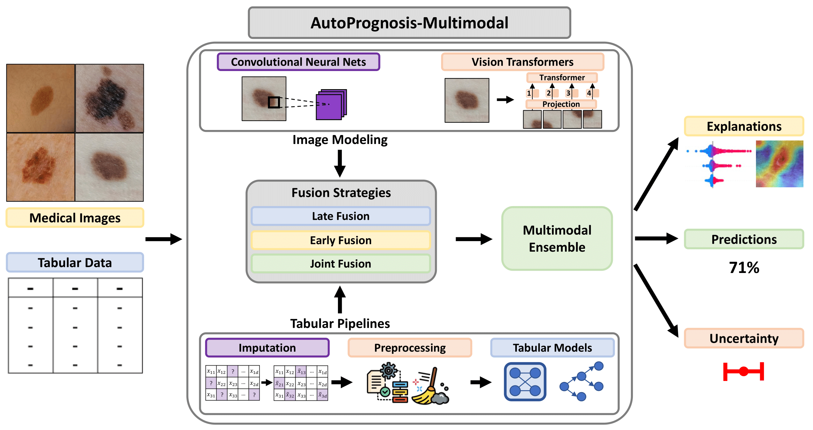

# AutoPrognosis-Multimodal - Automated Ensemble Multimodal Machine Learning for Healthcare

<div align="center">

[](https://github.com/fimrie/AP2_multimodal_priv/blob/main/LICENSE)
[](https://www.vanderschaar-lab.com/)

</div>



## :key: Features

- Develop unimodal predictors for tabular and imaging modalities
- Multiple fusion strategies:
    - Late fusion
    - Early fusion
    - Joint fusion
- Automatically learns the optimal combination of unimodal and fusion strategies as an ensemble

## :rocket: Installation

AutoPrognosis-M relies on several core dependencies. These can be installed as follows:

#### Using pip

Install all required dependencies using pip:
```bash
$ pip install -r requirements.txt
```

## :boom: Sample Usage


### Configuration:
All configurations are done in a configuration file. An example configuration file is provided in the `example_configs` directory.

```
{
    "base_experiment_dir": "path/to/experiments",
    "base_checkpoint_dir": "path/to/checkpoints",
    "index_column": "img_id",
    "target_column": "target",
    "configurations": [
        { 
            "type": "tabular",
            "classifier": {
                // autoprognosis parameters
            }
        },
        {
            "type": "imaging",
            "model": "DinoV2Base",
        }, 
        {
            "type": "joint_fusion",
            "model": "DinoV2Base",
        },
        {
            "type": "late_fusion",
            "imaging": {
                // imaging configuration as above
            },
            "tabular": {
                // tabular configuration as above
            }
        },
        {
            "type": "early_fusion",
            "model": "Classifier",
            "imaging": {
                // imaging configuration as above
            },
        }
    ]
}
```

> **_NOTE:_** Models can be selected from the list of available models in the `src/models.py` file.

Example usage: 
    
```
python3 run.py --config PAD_UFES/config.json --train-csv path/to/train.csv --val-csv path/to/val.csv --test-csv path/to/test.csv 
```

> **_NOTE:_** The train, val and test csv files need the target_column and index_column, with the index_column containing the (ideally absolute) path to the images.

## :high_brightness: Tutorials

Example usage of key functionality can be found in the following tutorials:

- [](https://colab.research.google.com/github/vanderschaarlab/AutoPrognosis-Multimodal/blob/master/examples/autoprognosis-m.ipynb) [Autoprognosis-Multimodal](examples/autoprognosis-m.ipynb)
- [](https://colab.research.google.com/github/vanderschaarlab/AutoPrognosis-Multimodal/blob/master/examples/interpretability_vision.ipynb) [Interpretability](examples/interpretability_vision.ipynb)

## :zap: Models

### Image architectures & pretrained implementations

| Name | Description | Reference | Model card |
|--- | --- | --- | --- |
|**ResNet-18**| CNN-based model architecture using residual connections (18 layers) | [Paper](https://ieeexplore.ieee.org/stamp/stamp.jsp?arnumber=7780459) | [Model Card](https://huggingface.co/microsoft/resnet-18)
|**ResNet-34**| CNN-based model architecture using residual connections (34 layers) | [Paper](https://ieeexplore.ieee.org/stamp/stamp.jsp?arnumber=7780459) | [Model Card](https://huggingface.co/microsoft/resnet-34)
|**ResNet-50**| CNN-based model architecture using residual connections (50 layers) | [Paper](https://ieeexplore.ieee.org/stamp/stamp.jsp?arnumber=7780459) | [Model Card](https://huggingface.co/microsoft/resnet-50)
|**ResNet-101**| CNN-based model architecture using residual connections (101 layers) | [Paper](https://ieeexplore.ieee.org/stamp/stamp.jsp?arnumber=7780459) | [Model Card](https://huggingface.co/microsoft/resnet-101)
|**ResNet-152**| CNN-based model architecture using residual connections (152 layers) | [Paper](https://ieeexplore.ieee.org/stamp/stamp.jsp?arnumber=7780459) | [Model Card](https://huggingface.co/microsoft/resnet-152)
|**EfficientNet-B0**| CNN-based model architecture  | [Paper](https://proceedings.mlr.press/v97/tan19a/tan19a.pdf) | [Model Card](https://huggingface.co/google/efficientnet-b0)
|**EfficientNet-B1**| CNN-based model architecture  | [Paper](https://proceedings.mlr.press/v97/tan19a/tan19a.pdf) | [Model Card](https://huggingface.co/google/efficientnet-b1)
|**EfficientNet-B2**| CNN-based model architecture  | [Paper](https://proceedings.mlr.press/v97/tan19a/tan19a.pdf) | [Model Card](https://huggingface.co/google/efficientnet-b2)
|**EfficientNet-B3**| CNN-based model architecture  | [Paper](https://proceedings.mlr.press/v97/tan19a/tan19a.pdf) | [Model Card](https://huggingface.co/google/efficientnet-b3)
|**EfficientNet-B4**| CNN-based model architecture  | [Paper](https://proceedings.mlr.press/v97/tan19a/tan19a.pdf) | [Model Card](https://huggingface.co/google/efficientnet-b4)
|**EfficientNet-B5**| CNN-based model architecture  | [Paper](https://proceedings.mlr.press/v97/tan19a/tan19a.pdf) | [Model Card](https://huggingface.co/google/efficientnet-b5)
|**MobileNetv2**| CNN-based model architecture  | [Paper](https://openaccess.thecvf.com/content_cvpr_2018/papers/Sandler_MobileNetV2_Inverted_Residuals_CVPR_2018_paper.pdf) | [Model Card]()
|**ViT - Base**| Transformer-based model architecture | [Paper](https://openreview.net/pdf?id=YicbFdNTTy) | [Model Card](https://huggingface.co/google/vit-base-patch16-224)
|**ViT - Large**| Transformer-based model architecture | [Paper](https://openreview.net/pdf?id=YicbFdNTTy) | [Model Card](https://huggingface.co/google/vit-large-patch16-224)
|**DinoV2 - Small**| Transformer-based model architecture (distilled, self-supervised ViT) | [Paper](https://openreview.net/pdf?id=a68SUt6zFt) | [Model Card](https://huggingface.co/facebook/dinov2-small)
|**DinoV2 - Base**| Transformer-based model architecture (distilled, self-supervised ViT) | [Paper](https://openreview.net/pdf?id=a68SUt6zFt) | [Model Card](https://huggingface.co/facebook/dinov2-base)
|**DinoV2 - Large**| Transformer-based model architecture (distilled, self-supervised ViT) | [Paper](https://openreview.net/pdf?id=a68SUt6zFt) | [Model Card](https://huggingface.co/facebook/dinov2-large)


## Citing
If you use this code or found it useful, please consider citing the associated paper:

```
```

## References
1. [Automated Ensemble Multimodal Machine Learning for Healthcare]()
2. [AutoPrognosis 2.0: Democratizing Diagnostic and Prognostic Modeling in Healthcare with Automated Machine Learning](https://journals.plos.org/digitalhealth/article?id=10.1371/journal.pdig.0000276)
